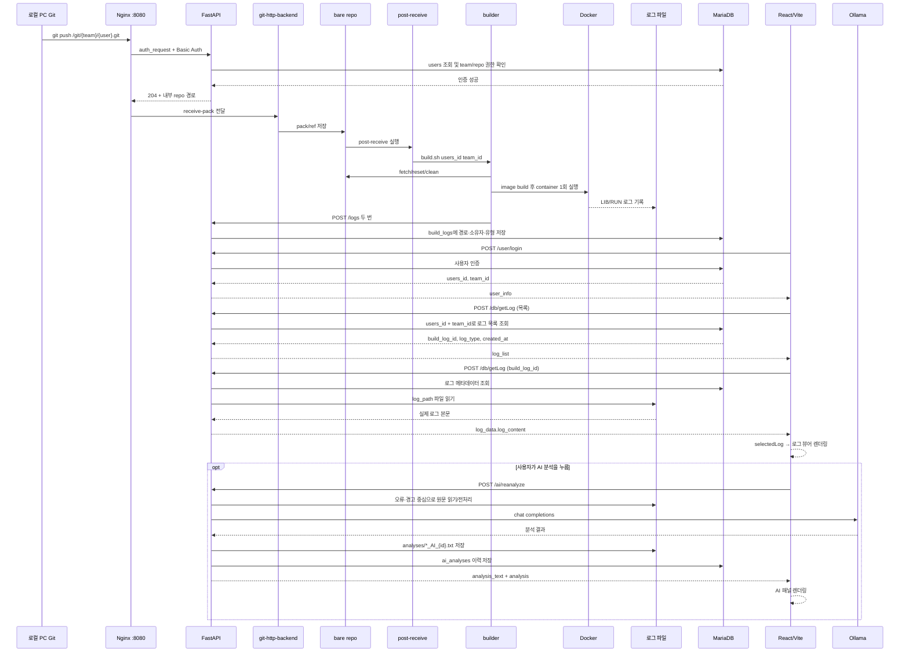

# LogPlus 전체 흐름 아키텍처

기준일: 2026-09-20
대상: `/app/logplus-platform`
목적: 로컬 PC의 Git 요청이 서버 빌드·로그 저장을 거쳐 브라우저 화면에 표시되는 현재 구현을 한 장의 흐름으로 정리한다.

## 1. 전체 구성

```mermaid
flowchart LR
    PC[로컬 PC<br/>Git CLI 또는 VS Code]
    BROWSER[로컬 PC 브라우저]

    subgraph SERVER[LogPlus 서버]
        WEB[React/Vite 웹<br/>기본 포트 5174]
        NGINX[Nginx<br/>Git Smart HTTP :8080]
        AUTH[FastAPI GitAuth<br/>/internal/git-auth]
        CGI[fcgiwrap<br/>git-http-backend]
        API[FastAPI API :8000]
        HOOK[bare repo<br/>post-receive hook]
        BUILDER[services/builder/build.sh]
        REPO[(bare Git repo<br/>/repos/{team}/{user}.git)]
        WORK[(사용자 작업본<br/>projects/{team}/{user})]
        DOCKER[Docker build/run]
        LOGFS[(로그 파일<br/>logs/{team}/{user})]
        DB[(MariaDB<br/>users / teams / build_logs / ai_analyses)]
        OLLAMA[Ollama<br/>Chat Completions]
    end

    PC -->|git push| NGINX
    NGINX -. auth_request .-> AUTH
    AUTH --> DB
    NGINX --> CGI --> REPO
    REPO --> HOOK --> BUILDER
    BUILDER --> WORK
    BUILDER --> DOCKER --> LOGFS
    BUILDER -->|POST /logs: lib, run| API
    API --> DB
    API --> LOGFS

    BROWSER --> WEB
    BROWSER -->|login / logs / AI REST| API
    API -->|로그 내용| BROWSER
    API -->|분석 요청| OLLAMA
    OLLAMA -->|한국어 분석 결과| API
```

핵심 경계는 다음과 같다.

- `/repos`는 Git 원본과 ref를 보관하는 bare repository다.
- `projects`는 builder가 빌드하기 위한 checkout 작업본이다.
- `logs`는 LIB/RUN 원문과 AI 분석 TXT를 보관하고, MariaDB에는 경로와 메타데이터를 보관한다.
- 브라우저의 로그인 정보는 현재 Zustand 메모리 상태에만 있다. 서버 세션이나 토큰은 사용하지 않는다.

## 2. 로컬 PC push부터 화면 표시까지



### 단계별 책임

1. 회원가입(`/user/register`)은 기존 팀을 확인한 뒤 사용자 행, 작업본 디렉터리, bare repo, hook을 준비한다.
2. Git push의 인증은 Nginx가 FastAPI `/internal/git-auth`에 위임한다. 성공한 요청만 `git-http-backend`로 간다.
3. `post-receive`는 `/app/logplus-platform/services/builder/build.sh`를 `users_id`, `team_id`와 함께 호출한다.
4. builder는 bare repo를 작업본으로 동기화하고 Dockerfile을 사용하거나 언어별 Dockerfile을 만든다.
5. Docker build 결과는 LIB 로그, 실행 결과는 RUN 로그로 나뉘어 저장된다. 현재 예제의 실행 종료 코드가 1이어도 RUN 로그는 저장·조회할 수 있다.
6. builder는 FastAPI `/logs`에 두 로그의 파일 경로를 등록하고, API가 `build_logs` 메타데이터를 MariaDB에 기록한다.
7. 웹의 로그 선택은 먼저 목록을 받고, 선택 시 API가 DB의 `log_path`를 따라 서버 파일을 읽어 본문을 반환한다.
8. React는 응답의 `selectedLog.log_content`를 줄 단위로 화면에 그리고 ERROR/WARN/INFO/DEBUG 강조를 적용한다.

## 3. 컴포넌트와 소스 위치

| 컴포넌트 | 소스 | 책임 |
| --- | --- | --- |
| React/Vite | `apps/web/src/` | 로그인, 대시보드, 로그 선택·표시, AI 결과 표시 |
| 사용자 상태 | `apps/web/src/store/store.ts` | `users_id`, `team_id`를 브라우저 메모리에 보관 |
| FastAPI 조립 | `apps/api/main.py` | `/health`, `/logs`, 라우터 등록, CORS |
| 회원가입 | `apps/api/CreateUser.py` | 사용자·작업본·bare repo·hook 생성 |
| 로그인 | `apps/api/LoginUser.py` | 사용자 인증과 `user_info` 반환 |
| Git 인증 | `apps/api/GitAuth.py` | Basic Auth 및 자기 team/user repo 여부 확인 |
| 로그 조회 | `apps/api/SelectLogs.py` | 목록 조회, `log_path` 파일 본문 반환 |
| AI 분석 | `apps/api/Aireanalyze.py` | 로그 전처리, Ollama 호출, 분석 파일·이력 저장 |
| 자동 빌드 | `services/builder/build.sh` | checkout 동기화, Docker build/run, LIB/RUN 등록 |
| Git 진입점 | `infra/nginx/logplus-git.conf` | auth_request, fcgiwrap, git-http-backend 연결 |
| API 서비스 | `infra/systemd/logplus-api.service` | FastAPI 8000 실행 및 운영 로그 연결 |

## 4. API와 데이터 계약

| 호출자 | API | 결과 |
| --- | --- | --- |
| 웹 | `POST /user/login` | 사용자 인증 후 `users_id`, `team_id` |
| 웹 | `POST /user/register` | 팀 검증, 사용자·Git 저장소 생성 |
| builder | `POST /logs` | LIB/RUN 파일 경로를 `build_logs`에 등록 |
| 웹 | `POST /db/getLog` | `build_log_id`가 없으면 목록, 있으면 파일 본문 |
| 웹 | `POST /ai/reanalyze` | 로그 분석, TXT 저장, `ai_analyses` 이력과 결과 반환 |
| 웹 | `POST /ai/history`, `GET /ai/download` | AI 분석 이력 조회·다운로드 |
| Nginx | `GET /internal/git-auth` | Git Basic Auth 및 repository 권한 위임 |
| 운영 확인 | `GET /health` | FastAPI와 DB 연결 상태 확인 |

저장 데이터는 다음처럼 분리된다.

```text
MariaDB
├─ teams          팀 식별자
├─ users          로그인 ID, team_id, role
├─ build_logs     로그 ID, 유형, 실제 파일 경로, 생성 시각
└─ ai_analyses    분석 ID, 대상 로그, 분석 파일 경로, 생성 시각

파일 시스템
├─ /repos/{team}/{user}.git
├─ /app/logplus-platform/projects/{team}/{user}
└─ /app/logplus-platform/logs/{team}/{user}
   ├─ *_LIB.log
   ├─ *_RUN.log
   └─ analyses/*_AI_{analysis_id}.txt
```

## 5. 현재 화면에 실제 연결된 범위

실제 API 데이터가 화면까지 연결되는 부분은 로그인, 로그 목록, 로그 상세 본문, AI 재분석 결과다. 대시보드의 일부 통계 카드·최근 알림·예외 TOP·막대 차트는 현재 `Index.tsx`의 샘플 데이터이며 `build_logs` 집계 API와 아직 연결되지 않았다. 또한 Docker 컨테이너는 현재 `docker run --rm`으로 한 번 실행되어 결과를 로그로 남기는 구조라, 사용자 컨테이너의 웹 화면을 외부에 서비스하는 구조는 아니다. 여기서 “화면에 띄운다”는 LogPlus 로그 대시보드에 실행 결과를 표시하는 의미다.

## 6. 검증 근거

- `GET http://127.0.0.1:8000/health`가 `{"status":"ok","db":"connected"}`를 반환했다.
- Nginx의 `/git/info/refs`는 인증 헤더가 없을 때 `401`, 잘못된 `/git/` 경로는 `403`으로 차단됐다.
- 운영 builder 로그에 repository 동기화 → Docker build 성공 → Docker run → `POST /logs` 두 건 → 종료 순서가 기록되어 있다.
- API 로그에 `/logs` 200, `/db/getLog` 200, `/ai/reanalyze` 200, Git auth 204 기록이 남아 있다.
- `/logs/test1` 조회 결과에는 `test_project/test1`의 LIB/RUN 로그 쌍과 `build_log_id`가 반환된다.
- 웹 개발 서버 로그에는 5174가 사용 중일 때 5175 이후 포트로 이동한 과거 이력이 있다. 현재 스크립트는 5174 `strictPort`를 사용하므로 기존 프로세스 정리가 필요하다.
- 문서 작업 중간에는 API health와 Nginx 인증 게이트가 응답했지만, 최종 probe에서는 두 포트가 `connection refused`를 반환했다. 서비스 재기동은 하지 않았으므로 현재 실행 상태는 별도 확인이 필요하다.

## 7. 다음 운영 보완

- 로그인·Git 인증을 평문 비밀번호 비교에서 Argon2/bcrypt 검증으로 전환한다.
- `/db/getLog`, `/ai/*` 요청의 `users_id`, `team_id`를 브라우저 body만 믿지 않도록 세션 또는 토큰 인증을 붙인다.
- DB URL과 실제 운영 비밀값은 `apps/api/.env`/systemd EnvironmentFile로만 주입하고 소스에는 남기지 않는다.
- CORS를 허용된 웹 주소로 제한한다.
- hook 내부 동기 빌드를 queue/worker와 사용자별 lock으로 분리한다.
- Vite는 5174 단일 프로세스만 유지하고, 운영에서는 정적 빌드 산출물을 Nginx 등으로 서비스한다.
- 정적 통계·알림·예외 집계를 `build_logs`/로그 분석 API와 연결한다.
